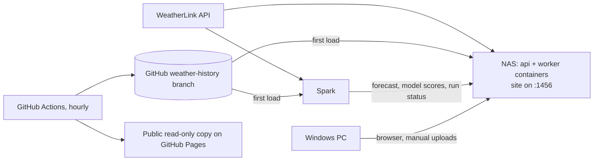

# Home Weather Machine Guides

What to run on each machine at home. The NAS runs the website and keeps the station data current in two containers. The Spark keeps its own copy of the data, trains the forecast models, runs the Ollama forecaster every evening and sends the results to the NAS. The Windows PC is where you look at the site, upload a file by hand and edit code.

## At a glance



WeatherLink feeds both the NAS and the Spark directly. The Spark sends its results to the NAS, and the GitHub history branch gives either machine its first copy of the data in minutes.

## NAS: the website and the data

The NAS runs two containers built from one image ([`Dockerfile`](../Dockerfile), [`compose.yaml`](../compose.yaml)). `api` serves the website and the API on port 1456 and updates the database schema when it starts. `worker` reads current conditions every minute and tops up the archive every 15 minutes. The database lives in the `weather-data` volume. Any NAS that runs Docker Compose v2 works, on Intel or ARM (Synology Container Manager, QNAP Container Station, Unraid, TrueNAS).

**First-time setup** (SSH into the NAS):

1. Get the code: `git clone https://github.com/lgriffin/weatherlink_website.git` and `cd weatherlink_website`.
2. Make the settings file: `cp .env.example .env`. Then fill in `WEATHERLINK_API_KEY`, `WEATHERLINK_API_SECRET` and `INGEST_TOKEN`. Make the token with `openssl rand -hex 24`; the Spark and Windows use the same value.
3. Build and start: `docker compose up -d --build`. The first build takes a few minutes.
4. Load the history from the GitHub branch, which takes a few minutes instead of an hour:
   1. `git clone -b weather-history --depth 1 https://github.com/lgriffin/weatherlink_website.git ../weather-history`
   2. `docker compose run --rm -v "$PWD/../weather-history:/history:ro" worker archive import --from /history`
   3. `docker compose run --rm worker archive harvest` fetches the days since the branch was last updated.
   4. `docker compose run --rm worker archive rebuild`
5. Open `http://<nas>:1456`. The Outputs page should show the harvest and rebuild runs.
6. Record the outage lists: `docker compose run --rm worker archive gaps --save`, and for the wind sensor `docker compose run --rm worker archive gaps --measurement wind.speed --min-hours 24`.

**Keeping it running**

- Update: `git pull && docker compose up -d --build`.
- Logs: `docker compose logs -f worker`.
- Weekly copy of the history to a NAS share (add it in the NAS task scheduler): `docker compose run --rm -v /volume1/weather-history:/history worker archive export --to /history`. The containers run as user 1001, so run `sudo chown -R 1001 /volume1/weather-history` once first.
- Backups: the `weather-data` volume holds everything. The `weather-history` branch on GitHub is the off-site copy.
- If the site will be reachable from the internet, put it behind the NAS reverse proxy with HTTPS, because uploads carry the token. Don't forward port 1456 directly.

## Spark: training and the evening forecast

The Spark keeps its own copy of the database, because SQLite shouldn't be opened over a network share. Every evening it tops up that copy from WeatherLink, runs the forecast, asks your Ollama model for the wording and sends the result to the NAS. Once a week it retrains. These steps assume an NVIDIA DGX Spark (ARM64, DGX OS on Ubuntu).

**One-time setup**

1. Tools: `sudo apt install -y git python3-venv build-essential cmake`, then Node 22: `curl -fsSL https://deb.nodesource.com/setup_22.x | sudo -E bash - && sudo apt install -y nodejs && sudo corepack enable`.
2. Set the clock to Irish time so the cron times below are local: `sudo timedatectl set-timezone Europe/Dublin`.
3. Code: `git clone https://github.com/lgriffin/weatherlink_website.git ~/weatherlink_website`, then `cd ~/weatherlink_website && pnpm install`.
4. Settings: `cp .env.example .env`. Fill in the WeatherLink key and secret, the same `INGEST_TOKEN` as the NAS, `SITE_URL=http://<nas>:1456`, and `FORECAST_MODEL=llama3.2:3b` for now.
5. Data:
   1. `pnpm db:migrate`
   2. `git clone -b weather-history --depth 1 https://github.com/lgriffin/weatherlink_website.git ~/weather-history`
   3. `pnpm archive:import --from ~/weather-history`
   4. `pnpm archive:harvest`
   5. `pnpm archive:rebuild`
6. Python: `cd ml && python3 -m venv .venv && .venv/bin/pip install -r requirements-dev.txt && .venv/bin/python -m pytest`. All tests should pass.
7. First training run: `.venv/bin/python -m wxml train`, then from the repo root `scripts/push-output.sh model-scores ml/out/metrics.json`. The scores appear on the Outputs page.
8. Ollama: `curl -fsSL https://ollama.com/install.sh | sh`, then `ollama pull llama3.2:3b`. Try it with `cd ml && .venv/bin/python -m wxml predict --ask llama3.2:3b`.

**Scheduled jobs** (`crontab -e`)

```
PATH=/usr/local/bin:/usr/bin:/bin
25 18 * * * $HOME/weatherlink_website/scripts/spark-evening.sh >> $HOME/weather-evening.log 2>&1
0 4 * * 0 $HOME/weatherlink_website/scripts/spark-weekly.sh >> $HOME/weather-weekly.log 2>&1
```

The evening job ([`scripts/spark-evening.sh`](../scripts/spark-evening.sh)) runs at 18:25 because the forecast is issued from the 18:00 reading, and WeatherLink needs a few minutes to have it. The weekly job ([`scripts/spark-weekly.sh`](../scripts/spark-weekly.sh)) retrains on Sunday at 04:00 and sends the new scores, plus whether the run worked.

**Your own forecaster (fine-tuning)**

1. Build the training set: `cd ml && .venv/bin/python -m wxml llm-dataset`. Read a sample of `out/llm/review.csv` and edit anything that doesn't sound like you.
2. Copy the fine-tune script next to the data: `cp ollama/finetune_unsloth.py out/finetune.py`.
3. Start NVIDIA's PyTorch container with the ml output folder mounted: `docker run --gpus all --ulimit memlock=-1 --ulimit stack=67108864 -it --rm -v ~/weatherlink_website/ml/out:/work nvcr.io/nvidia/pytorch:25.11-py3 bash`.
4. Inside it, install Unsloth as [NVIDIA's DGX Spark playbook](https://build.nvidia.com/spark/unsloth/instructions) does: `pip install transformers peft hf_transfer "datasets==4.3.0" "trl==0.26.1"` and `pip install --no-deps unsloth unsloth_zoo bitsandbytes`.
5. Train a LoRA adapter on `/work/llm/train.jsonl`: `python /work/finetune.py`. It merges the result into `/work/merged`.
6. Back on the Spark, load it into Ollama: `cd ~/weatherlink_website/ml && .venv/bin/python -m wxml modelfile --base ./out/merged && ollama create station-forecaster -f out/Modelfile`.
7. Compare it with the stock model on a few evenings: `.venv/bin/python -m wxml predict --ask station-forecaster`. When you prefer it, set `FORECAST_MODEL=station-forecaster` in `.env`.

The script is [`ml/ollama/finetune_unsloth.py`](../ml/ollama/finetune_unsloth.py). It is a starting point and has not been run on a Spark yet. Retrain the language model every few months, after the weekly job has refreshed the numeric models.

## Windows: looking, uploading and editing

Nothing has to run on the Windows PC for the site to work. It's where you read the site, send a file by hand, open the history in Excel and change code.

- **Read the site:** `http://<nas>:1456` at home. The public copy is https://lgriffin.github.io/weatherlink_website/.
- **Upload by hand:** on the Outputs page, pick the kind of file, choose the JSON file, paste the upload token and press Upload.
- **Upload from PowerShell:** install [Git for Windows](https://git-scm.com/download/win) and clone the repo. Put `SITE_URL=` and `INGEST_TOKEN=` lines in its `.env`, then run `.\scripts\push-output.ps1 -Kind model-scores -File .\metrics.json`. If Windows blocks the script, run `powershell -ExecutionPolicy Bypass -File .\scripts\push-output.ps1 -Kind … -File …`.
- **History in Excel:** `git clone -b weather-history --depth 1 https://github.com/lgriffin/weatherlink_website.git weather-history`. Then open `stations\<id>\daily\2025\2025-07.csv`: one row per day and measurement, in °C, mm and m/s.
- **History in Google Drive:** with Google Drive for desktop installed, clone or copy that folder into `G:\My Drive\weather-history` and it syncs. From a working copy of the site you can also write it there directly: `pnpm archive:export --to "G:\My Drive\weather-history"`.
- **Edit code:** install Node 22 and VS Code, then run `corepack enable`, `pnpm install` and `pnpm test` in the repo. `pnpm dev` runs the site locally on its own database. Push changes on a branch; merging to main republishes the public site.

## Sending outputs to the site

The Outputs page shows the newest file of each of four kinds, and keeps the last 50 of each. Each upload needs the site's `INGEST_TOKEN`; without it, the site refuses the upload and stores nothing.

| Kind | What the page shows | The file | Sent by |
| --- | --- | --- | --- |
| `forecast` | Tonight's low, frost chance, tomorrow's high, rain chance and the Ollama wording | `python -m wxml predict --json [--ask MODEL]` | Spark, every evening |
| `model-scores` | Each model against "normal for the date" and "same as yesterday" | `ml/out/metrics.json` | Spark, after each training run |
| `outages` | Every gap in the data and its cause | `archive gaps --json`, or `--save` stores it directly | NAS, after harvests |
| `harvest` | Whether the last harvest, rebuild or training run worked | `{"status": "ok", "task": "train"}` | NAS automatically; Spark weekly |

The same upload from each place:

- **Linux or the Spark:** `scripts/push-output.sh forecast ml/out/forecast.json`
- **Windows:** `.\scripts\push-output.ps1 -Kind forecast -File .\forecast.json`
- **Browser:** the upload form at the bottom of the Outputs page.
- **Anything else:** `curl -X POST http://<nas>:1456/api/v1/ingest/forecast -H "Authorization: Bearer $INGEST_TOKEN" -H "X-Source: spark" -H "Content-Type: application/json" --data-binary @forecast.json`

A file with the wrong shape gets a 400 saying which field is wrong. A wrong token gets a 401. A site with no token set gets a 503. Keep the token in each machine's `.env`, which git ignores, and never commit it.

## Assumptions and open questions

- "Spark" is taken to be an NVIDIA DGX Spark. If it's a different GPU machine, the Ollama steps still apply, but the Unsloth container step changes.
- `<nas>` stands for your NAS's name or IP address. The NAS brand doesn't matter as long as it runs Docker Compose v2.
- The container image has not been built yet: the cloud sandbox couldn't download packages. It was checked by running the API the same way the container does. Your first `docker compose up --build` is its first real build.
- The fine-tuning script has not been run on a Spark yet. Treat it as a starting point.
- Where will the public web app live? Behind the NAS reverse proxy with HTTPS, or somewhere else? GitHub Pages stays as the public read-only copy either way.
